<p align="center">
  
</p>

<h1 align="center">Transportable Detonation Chamber</h1>

<p align="center">
  <strong>A pre-configured Windows 11 VM for malware detonation testing against multiple EDR solutions.</strong>
</p>

<p align="center">
  <a href="#quick-start"></a>
  <a href="#features"></a>
  <a href="#demo"></a>
  <a href="#api-reference"></a>
</p>

<p align="center">
  
  
  
  
  
  
  
</p>

---

<p align="center">
  <em>Unified dark-themed Web UI &bull; Real-time Sigma/YARA/IOC detection &bull; Kernel ETW telemetry &bull; PE/ELF binary analysis</em>
</p>

<p align="center">
  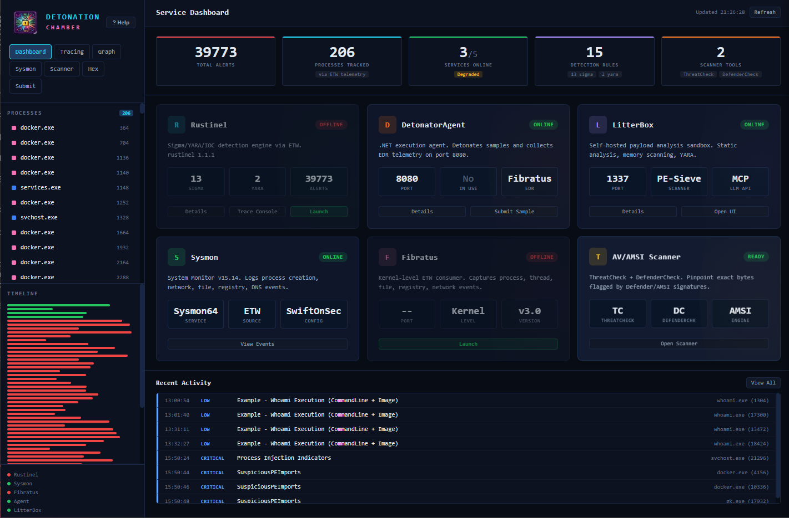
  <br><sub>Service Dashboard &mdash; real-time health monitoring, alert feed, and detection metrics</sub>
</p>

---

## Table of Contents

- [Quick Start](#quick-start)
- [Features](#features)
- [Architecture](#architecture)
- [Platform Support](#platform-support)
- [Prerequisites](#prerequisites)
- [Installation](#installation)
- [Usage](#usage)
- [Demo](#demo)
- [API Reference](#api-reference)
- [Configuration](#configuration)
- [Detection Rules](#detection-rules)
- [File Structure](#file-structure)
- [Troubleshooting](#troubleshooting)
- [Security Notes](#security-notes)
- [Credits](#credits)

---

## Quick Start

### Option A: Local UI Only (no VM)

Run the Web UI locally for development or UI testing. Backend services won't be available, but all tabs and features render normally.

```bash
# macOS / Linux
make install    # Creates venv, installs Flask + deps
make run        # Starts on http://localhost:9000

# Windows (PowerShell)
.\make.ps1 install
.\make.ps1 run
```

### Option B: Full VM (recommended for analysis)

```bash
# macOS Apple Silicon (M1-M4) — UTM-based setup (recommended)
./scripts/setup-macos-utm.sh    # Guided: installs tools, creates VM, provisions

# macOS / Linux — Vagrant-based (requires pre-built box)
make up         # Provisions the full Windows 11 VM
make open       # Opens http://<vm-ip>:9000 in browser

# Windows (PowerShell, run as Administrator)
.\make.ps1 up
.\make.ps1 open
```

> First boot takes ~20-30 minutes (Windows) or ~30-45 minutes (macOS ARM).

---

## Features

### Detection Engines

| Engine | Technology | Capabilities |
|--------|-----------|--------------|
| **Rustinel** | Rust + ETW | 20 Sigma rules, 717 YARA rules, IOC hash matching, real-time NDJSON alerts |
| **Fibratus** | Go + Kernel ETW | Process/file/registry/network telemetry, behavior rules |
| **Sysmon** | Sysinternals | Event logging (process creation, network, file, registry, image loads) |
| **LitterBox** | Python | Static (YARA, strings) + Dynamic (PE-Sieve, Moneta, HollowsHunter, RedEdr) |

### Web UI Tabs

| Tab | Description |
|-----|-------------|
| **Dashboard** | Stats strip, 6 service health labels, recent activity feed, toast notifications |
| **Tracing** | Real-time ETW event console, process filtering, timeline visualization |
| **Graph** | Process relationship graph (Force/Hierarchical/Radial/Circular/Grid layouts) |
| **Sysmon** | Windows Sysmon event viewer with search, filtering, and Event ID correlation |
| **Scanner** | ThreatCheck + DefenderCheck integration with scan history |
| **ETW** | Multi-channel Event Log browser with live threat highlighting (see below) |
| **Hex Editor** | Binary viewer with data inspector, PE/ELF analysis, drag-and-drop |
| **Submit** | Multi-target detonation with stage-by-stage pipeline progress |

### ETW Browser

The ETW tab provides a multi-channel Windows Event Log viewer with automatic threat classification:

| Feature | Details |
|---------|---------|
| **12 Channels** | Sysmon, Security, PowerShell, Defender, WMI, Task Scheduler, BITS, DNS, Firewall, AppLocker, WinRM, Application |
| **Availability Probe** | Channels show ● ACTIVE / ○ NO DATA status on load |
| **Auto-Refresh** | Polls every 5s (toggleable), keyword filter across all fields |
| **Threat Highlighting** | Malicious events highlighted red with threat classification badge |
| **Expandable Details** | Click any event to inspect all data fields; suspicious values marked red |

Threat detection rules cover:

- **Encoded/obfuscated PowerShell** (base64, IEX, downloadstring, bypass, hidden)
- **LOLBin abuse** (certutil, mshta, regsvr32, rundll32, bitsadmin, wmic)
- **Credential access** (LSASS access, mimikatz, sekurlsa, procdump)
- **Persistence** (registry Run keys, scheduled tasks, services, WMI subscriptions)
- **Defense evasion** (AMSI bypass, ETW patching, process tampering)
- **Lateral movement** (explicit credential logon, WinRM, net use)
- **C2 indicators** (suspicious ports, .onion/.tk domains, DNS tunneling)
- **Sysmon IOCs** (CreateRemoteThread, DLL sideloading, ADS creation, process tampering)

### Binary Analysis (PE / ELF)

| Capability | Details |
|-----------|---------|
| **PE Header Analysis** | DOS/COFF/Optional headers, ASLR/DEP/SEH/CFG detection |
| **DiE-Style Detection** | Compiler, packer, protector, linker identification with assessment |
| **Entropy Heatmap** | 64-block Shannon entropy visualization (red >= 7.0 = packed) |
| **Section Layout** | Visual section diagram with RWX permission flagging |
| **ELF Security Audit** | PIE, NX stack, RELRO, stack canary, Fortify, stripped detection |
| **Suspicious Imports** | Categorized: injection, evasion, credential access, networking, crypto |
| **IOC Flags (clickable)** | Expandable detail panels showing matched APIs, detection rules, and explanations |
| **Packer Detection** | UPX, Themida, VMProtect, ASPack, MPRESS via section + heuristic matching |
| **TLS Callbacks** | Anti-debug indicator detection |

### Reverse Engineering Tools

| Tool | Purpose |
|------|---------|
| **Detect It Easy (DiE)** | PE/ELF/Mach-O identification — packers, compilers, protectors |
| **WinDbg (Preview)** | Kernel/user-mode debugger — crash dumps, live debugging, TTD |
| **Ghidra** | NSA RE framework — disassembly, decompilation, scripting |
| **Hunt-Sleeping-Beacons** | Callstack scanner for sleeping C2 beacons |

### Developer Experience

- **`make deploy-restart`**: Edit locally, push to VM, restart Flask in one command
- **`make run-debug`**: Flask auto-reload on file changes
- **Toast Notifications**: Throttled error/warning/info toasts with 15s dedup
- **Help Modal**: Built-in documentation (press "? Help" in sidebar)
- **Submissions History**: Persisted to JSON with quick hex inspection

---

## Architecture

```
┌─────────────────────────────────────────────────────────────────┐
│  Windows 11 VM (Hyper-V / QEMU)                                 │
│                                                                  │
│  ┌────────────┐   ┌────────────────┐   ┌────────────┐          │
│  │  Web UI    │   │ DetonatorAgent │   │ LitterBox  │          │
│  │  :9000     │──▶│  :8080         │   │  :1337     │          │
│  └────────────┘   └────────────────┘   └────────────┘          │
│       │                  │                   │                   │
│       └──────────────────▼───────────────────┘                  │
│                  ┌────────────────┐                              │
│                  │    Fibratus    │                              │
│                  │  Kernel ETW    │                              │
│                  └────────────────┘                              │
│                  ┌────────────────┐                              │
│                  │   Rustinel     │                              │
│                  │ Sigma+YARA+IOC │                              │
│                  └────────────────┘                              │
│                  ┌────────────────┐                              │
│                  │    Sysmon      │                              │
│                  │  Event Log     │                              │
│                  └────────────────┘                              │
└─────────────────────────────────────────────────────────────────┘
```

### Data Flow

1. Sample submitted via Web UI → forwarded to DetonatorAgent + LitterBox
2. DetonatorAgent executes the sample, returns PID
3. LitterBox runs static (YARA, CheckPlz, Stringnalyzer) + dynamic (PE-Sieve, Moneta, HollowsHunter, RedEdr) analysis
4. Fibratus captures kernel-level ETW events for the process
5. Rustinel matches events against Sigma + YARA rules + IOC hashes
6. Web UI aggregates alerts from all engines into unified timeline

### Services

| Service | Port | Purpose | Technology |
|---------|------|---------|------------|
| **Web UI** | 9000 | Unified dashboard & API gateway | Python / Flask |
| **DetonatorAgent** | 8080 | Executes malware samples, returns PID | .NET 8.0 |
| **LitterBox** | 1337 | Static + dynamic analysis sandbox | Python / Flask |
| **Fibratus** | 8180 | Kernel ETW telemetry & behavior rules | Go |
| **Rustinel** | — | Sigma/YARA/IOC real-time detection | Rust |
| **Sysmon** | — | Windows event logging | Sysinternals |
| **Hunt-Sleeping-Beacons** | — | Sleeping C2 beacon callstack scanner | C++ / MSVC |
| **theZoo-WebUI** | 8888 | Malware sample browser | PHP |
| **Detonator** | 5000/8000 | Orchestration UI + REST API | Python |

---

## Platform Support

| Host OS | Hypervisor | Guest Arch | Vagrantfile | Performance |
|---------|-----------|------------|-------------|-------------|
| Windows 10/11 (x86_64) | Hyper-V | x86_64 | `Vagrantfile` | Native |
| macOS Apple Silicon (M1-M4) | QEMU via vagrant-qemu | ARM64 | `Vagrantfile.utm` | Near-native via hvf |

### ARM64 Compatibility

| Component | ARM64 Support | Notes |
|-----------|--------------|-------|
| Sysmon | Native | `Sysmon64a.exe` (ARM64 binary) |
| Fibratus | Emulated (x86_64) | No ARM64 build; ~10-20% overhead |
| Rustinel | Emulated (x86_64) | No ARM64 build; ETW works under emulation |
| .NET 8 / Python 3.12 | Native | Full ARM64 SDK and runtime |
| DetonatorAgent | Native | Compiled from source via .NET 8 |
| Detonator / LitterBox | Native | Python-based |

---

## Prerequisites

### Windows Host

- Windows 10/11 with **Hyper-V** enabled
- **Vagrant** >= 2.4 ([download](https://www.vagrantup.com/downloads))
- **Administrator** PowerShell (required for Hyper-V)
- ~30 GB disk, ~8 GB RAM

```powershell
# Enable Hyper-V (reboot required)
Enable-WindowsOptionalFeature -Online -FeatureName Microsoft-Hyper-V -All
```

### macOS Host (Apple Silicon)

- macOS on Apple Silicon (M1/M2/M3/M4)
- **UTM** (recommended): `brew install --cask utm` or [mac.getutm.app](https://mac.getutm.app)
- **QEMU tools**: `brew install qemu` (for `qemu-img`)
- **Python 3** with `pywinrm`: `pip3 install pywinrm requests-ntlm`
- **Windows 11 ARM64 ISO** from [Microsoft](https://www.microsoft.com/software-download/windows11arm64)
- ~80 GB disk, ~8 GB RAM

#### Recommended Setup (UTM + automated provisioning)

The fastest path on Apple Silicon uses UTM as the hypervisor with automated
provisioning via WinRM. A single script handles everything after the initial
Windows installation:

```bash
# Full guided setup (installs prerequisites, guides VM creation, provisions)
./scripts/setup-macos-utm.sh

# Or step by step:
./scripts/setup-macos-utm.sh --skip-prerequisites   # if tools already installed
./scripts/setup-macos-utm.sh --provision-only --vm-ip 192.168.64.4  # re-provision existing VM
```

**Manual steps** (the script guides you through these):

1. Install UTM and create a Windows 11 ARM64 VM (8 GB RAM, 4 cores, 80 GB disk)
2. Install Windows normally with a local admin account (`vagrant`/`vagrant` recommended)
3. Run `scripts/prepare-vagrant-winrm.ps1` inside the VM (enables WinRM remote management)
4. Run `./scripts/setup-macos-utm.sh --provision-only --vm-ip <vm-ip>`

The provisioning installs all detection engines, analysis tools, and the unified
Web UI (~20-40 minutes on first run).

#### Alternative: Vagrant/QEMU (headless, experimental)

For a fully headless Vagrant-managed workflow, see [Vagrantfile.utm](Vagrantfile.utm).
This path requires building a custom `win11-arm` Vagrant box from the ISO:

```bash
make prerequisites-fix          # Install QEMU, Vagrant, vagrant-qemu plugin
./scripts/build-box-macos.sh --iso ~/Downloads/Win11_ARM64.iso
make build                      # Provision the VM
```

> **Note:** Headless QEMU boot of Windows 11 ARM64 ISOs can be unreliable on
> some QEMU/firmware combinations. The UTM path above is recommended.

### Local Development Only

- **Python 3.10+** (any platform)
- **Make** (macOS: Xcode CLI tools; Windows: not needed, use `make.ps1`)

---

## Installation

### Using make / make.ps1

The project includes a cross-platform build system:

| Command | Description |
|---------|-------------|
| `install` | Create Python venv + install Flask, requests, watchdog, pefile |
| `run` | Start Web UI locally on port 9000 |
| `run-debug` | Start with Flask auto-reload (watches file changes) |
| `up` | Provision and start the full VM |
| `halt` | Stop the VM gracefully |
| `destroy` | Delete the VM |
| `deploy` | Sync webui files (HTML/CSS/JS) to running VM |
| `deploy-app` | Sync Flask backend (app.py) to VM |
| `restart` | Restart the Web UI service on VM |
| `deploy-restart` | Deploy + restart in one step |
| `open` | Open Web UI in default browser |
| `status` | Show VM + service health |
| `services` | List all service states |
| `alerts` | Show recent detection alerts |
| `test` | Submit test sample to verify pipeline |
| `submit FILE=x` | Submit a file for detonation |
| `logs` | Tail Web UI logs from VM |
| `ssh` / `rdp` | Connect to VM |
| `clean` | Destroy VM + remove .vagrant |
| `clean-all` | Also remove cached Vagrant boxes |
| `uninstall` | Remove local Python venv |

**macOS / Linux:**
```bash
make install        # Local venv setup
make run            # Local server
make up             # Full VM
make deploy-restart # Push changes to VM
```

**Windows (PowerShell):**
```powershell
.\make.ps1 install
.\make.ps1 run
.\make.ps1 up              # Run as Administrator
.\make.ps1 deploy-restart
```

### Manual Installation

```bash
cd webui
python3 -m venv .venv
source .venv/bin/activate   # Windows: .venv\Scripts\activate
pip install -r requirements.txt
python app.py               # http://localhost:9000
```

---

## Usage

### Detonation Workflow

1. Open the Web UI at `http://localhost:9000`
2. Go to the **Submit** tab
3. Drag and drop (or browse) a malware sample
4. Select target: **Agent** (execution), **LitterBox** (analysis), or **Both**
5. Click Submit — watch the pipeline stages progress
6. Switch to **Tracing** tab to see real-time ETW alerts
7. Switch to **Graph** tab to see process relationships
8. Check **Dashboard** for severity breakdown

### CLI Submission

```bash
# macOS / Linux
make submit FILE=./samples/mimikatz.exe TARGET=both

# Windows
.\make.ps1 submit -File .\samples\mimikatz.exe -Target2 both
```

### Scanner Workflow

1. Go to **Scanner** tab
2. Upload a file (drag and drop) or enter a VM path
3. Select tool (ThreatCheck / DefenderCheck) and engine (Defender / AMSI)
4. Click Scan — results show detection status and trigger offset
5. Click "View in Hex" to jump to the flagged bytes

### PE Analysis

1. Go to **Hex Editor** tab
2. Upload a PE file
3. Click **PE Analysis** button
4. Review: headers, security features (ASLR/DEP/SEH/CFG), section entropy, suspicious imports, packer indicators, DiE-style detection overview

### ELF Analysis

1. Go to **Hex Editor** tab
2. Upload an ELF binary (Linux/BSD executables, shared objects)
3. Click **ELF Analysis** button
4. Review: ELF header, security audit (PIE/NX/RELRO/canary/Fortify), sections, segments, dynamic libraries, suspicious symbol imports

### Hunt-Sleeping-Beacons

Scan running processes for sleeping C2 beacons (RDP or SSH into VM):

```powershell
# Scan all processes
Hunt-Sleeping-Beacons.exe

# Scan a specific PID (e.g., after detonation)
Hunt-Sleeping-Beacons.exe -p 1234

# Include .NET processes (more false positives)
Hunt-Sleeping-Beacons.exe --dotnet

# Show command lines for suspicious processes
Hunt-Sleeping-Beacons.exe --commandline

# Shortcut alias
hsb --commandline
```

Detections include: unbacked memory in callstacks, non-executable memory pages, module stomping (SharedOriginal check), suspicious APC dispatchers, timer-based sleepmask callbacks, abnormal intermodular calls (module proxying), and return address spoofing (jmp gadget patterns).

---

## Demo

### Service Dashboard

<p align="center">
  
</p>

> The main landing page with a stats strip showing 39,773 total alerts, 206 tracked processes, 3/5 services online (degraded state), 15 detection rules (13 Sigma + 2 YARA), and 2 scanner tools. Below are 6 service health cards for Rustinel, DetonatorAgent, LitterBox, Sysmon, Fibratus, and AV/AMSI Scanner — each showing port, version, and quick-action buttons. The Recent Activity feed streams live detections with severity coloring (LOW Sigma rules like Whoami Execution, CRITICAL YARA hits like SuspiciousPEImports). The left sidebar lists all tracked processes with alert counts and a color-coded timeline per engine.

---

### Sample Detonation (Mimikatz)

<p align="center">
  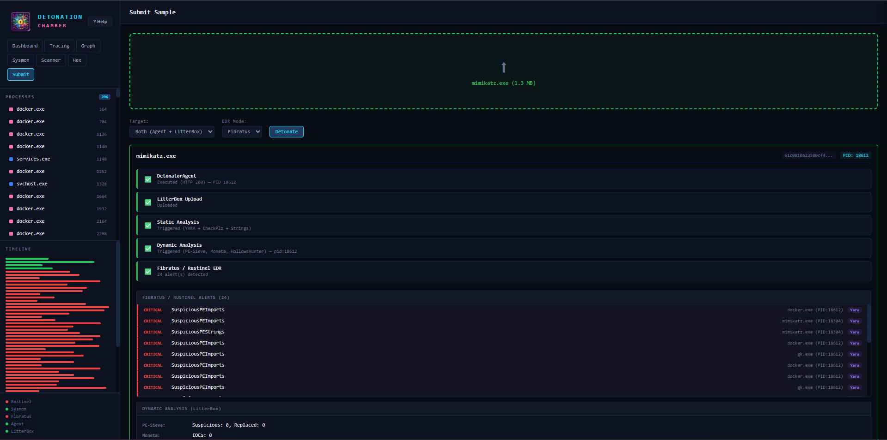
</p>

> The Submit tab after detonating `mimikatz.exe` (1.3 MB) with target "Both (Agent + LitterBox)" and Fibratus EDR mode. The pipeline shows all 5 stages completed: DetonatorAgent execution (HTTP 200, PID 18612), LitterBox upload, Static Analysis (YARA + CheckPlz + Strings), Dynamic Analysis (PE-Sieve, Moneta, HollowsHunter), and Fibratus/Rustinel EDR (24 alerts). Below lists all CRITICAL detections — SuspiciousPEImports on docker.exe, mimikatz.exe, and gk.exe. Dynamic results: PE-Sieve (Suspicious: 0) and Moneta (IOCs: 0).

---

### Rustinel Trace Analysis

<table>
<tr>
<td width="50%">
<p align="center">
  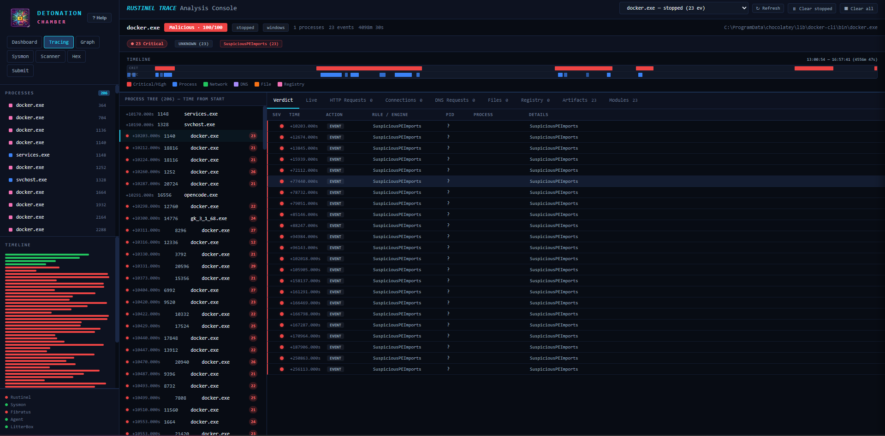
</p>
</td>
<td width="50%">
<p align="center">
  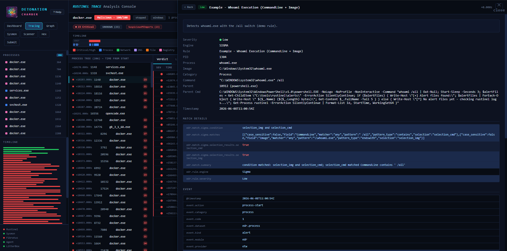
</p>
</td>
</tr>
</table>

> **Left:** The Tracing console for `docker.exe` scored "Malicious 100/100" (23 events over 4090m). Filter pills: "23 Critical", "SuspiciousPEImports (23)". The timeline bar shows event distribution by type (Critical/High, Process, Network, DNS, File, Registry). Verdict table lists each hit with severity, timestamp offset, rule name, and PID. Tabs for Live, HTTP Requests, Connections, DNS, Files, Registry, Artifacts (23), Modules.
>
> **Right:** Alert detail panel for a Sigma hit: "Example - Whoami Execution (CommandLine + Image)". Shows severity (Low), engine (SIGMA), PID (1304), process (whoami.exe), command line, parent info (powershell.exe PID 10912), full parent command. MATCH DETAILS shows condition logic (`selection_img AND selection_cmd`) with JSON patterns. EVENT section has complete ECS fields (@timestamp, event.action: process-start, event.kind: alert, event.provider: etw).

---

### Process Relationship Graph

<table>
<tr>
<td width="50%">
<p align="center">
  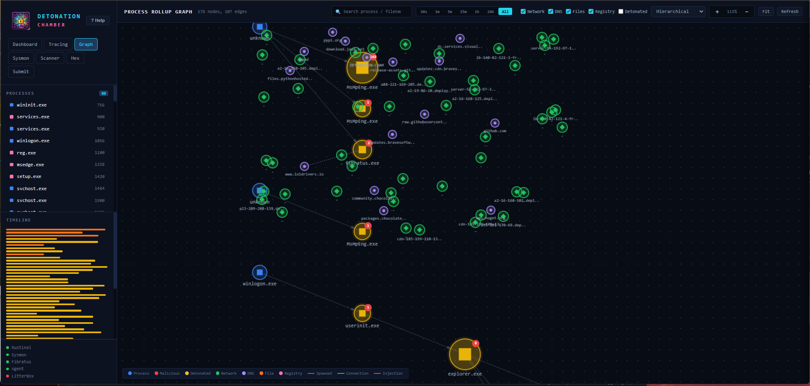
</p>
</td>
<td width="50%">
<p align="center">
  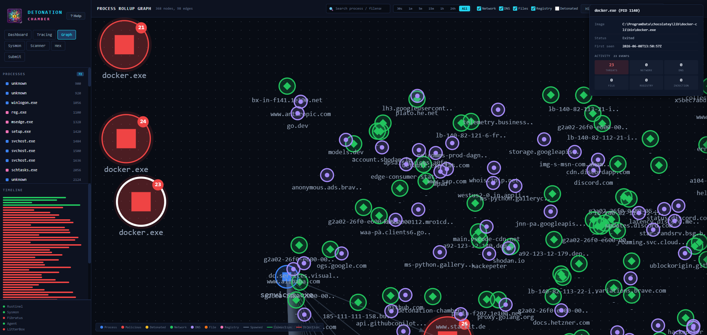
</p>
</td>
</tr>
</table>

> **Left:** Hierarchical layout showing 178 nodes, 107 edges at 115% zoom. Color-coded nodes: blue squares (system processes — winlogon.exe, explorer.exe, userinit.exe), yellow/orange with red badges (malicious/detonated — fibratus.exe, MsMpEng.exe), green diamonds (network connections — pypi.org, github.com, loldrivers.io, files.pythonhosted), purple circles (DNS). Edges: solid (spawn), dashed (connection), red (injection). Filters for Network, DNS, Files, Registry, Detonated. Time ranges: 30s to All.
>
> **Right:** Force-directed layout with `docker.exe (PID 1148)` selected. Detail panel: image path, status (Exited), activity (23 Threats, 0 Network/DNS/File/Registry/Injection). Three large red nodes (docker.exe instances with 21, 24, 23 alerts) surrounded by dense network/DNS web (discord.com, shodan.io, github.com, google.com, storage.googleapis, docs.hetzner.de, and dozens more).

---

### PE Binary Analysis

<table>
<tr>
<td width="50%">
<p align="center">
  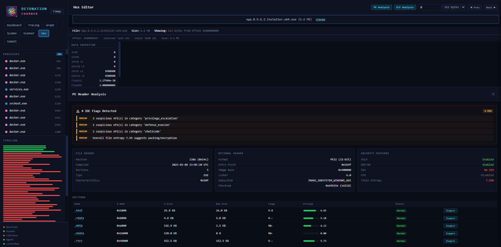
</p>
</td>
<td width="50%">
<p align="center">
  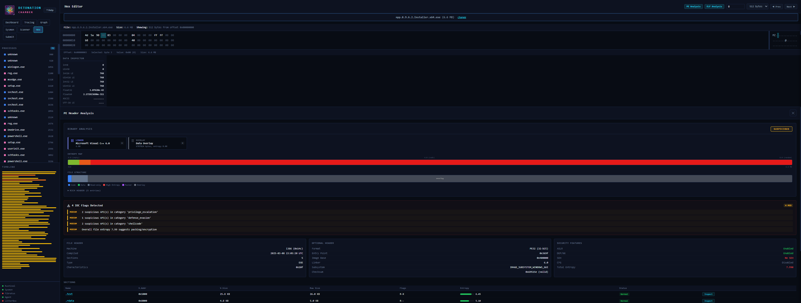
</p>
</td>
</tr>
</table>

> **Left:** PE Header Analysis for `npp.8.9.6.2.Installer.x64.exe` (6.6 MB). IOC banner: "4 IOC Flags Detected" — suspicious APIs in privilege_escalation (2), defense_evasion (1), shellcode (2), plus entropy 7.99 (packing). Three-column layout: FILE HEADER (i386, 2025-03-08, 5 Sections), OPTIONAL HEADER (PE32, Entry 0x369f, Linker 6.0, WINDOWS_GUI), SECURITY FEATURES (ASLR/DEP enabled, NO SEH, CFG disabled, Entropy 7.990 red). Section table with entropy bars and "Inspect" buttons.
>
> **Right:** DiE-style detection overview. Assessment: "SUSPICIOUS" (red badge). Detection cards: "LINKER: Microsoft Visual C++ 6.0", "OVERLAY: Data Overlay". ENTROPY MAP color bar — green (low entropy .text/.rdata), massive red block (.ndata = NSIS compressed data). FILE STRUCTURE section layout diagram with legend (Code, Data, High Entropy, Overlay). Expandable "+ RICH HEADER (5 entries)".

---

### Section Inspection & Hex Editor

<table>
<tr>
<td width="50%">
<p align="center">
  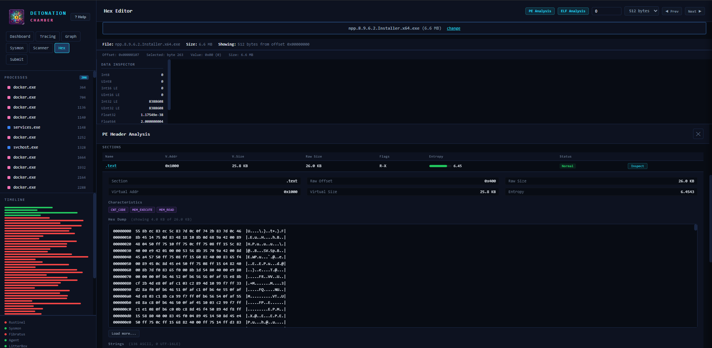
</p>
</td>
<td width="50%">
<p align="center">
  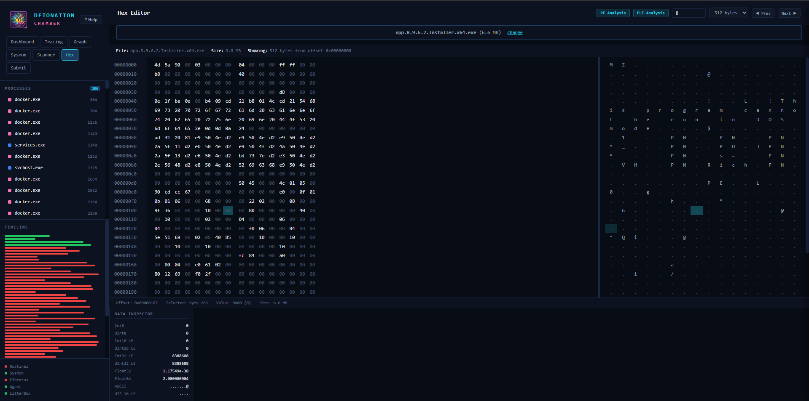
</p>
</td>
</tr>
</table>

> **Left:** .text section expanded via "Inspect". Metadata: Raw Offset 0x400, Raw Size 26.0 KB, Virtual Addr 0x1000, Entropy 6.4543. Characteristic badges: CNT_CODE, MEM_EXECUTE, MEM_READ. Live hex dump of first 4.0 KB with offsets, bytes, and ASCII. "Load more..." for paging. Below: "Strings (136 ASCII, # UTF-16LE)" for string extraction.
>
> **Right:** Raw hex editor showing 512 bytes at offset 0x00000000. MZ header visible (4D 5A 90...) with DOS stub. Right column: ASCII interpretation. Data Inspector below showing cursor value as Int8/16/32/64, Float32/64, ASCII, UTF-16 LE. Top-right: PE/ELF Analysis buttons, offset input, 512-byte pages with Prev/Next.

---

### Sysmon Event Monitoring

<table>
<tr>
<td width="50%">
<p align="center">
  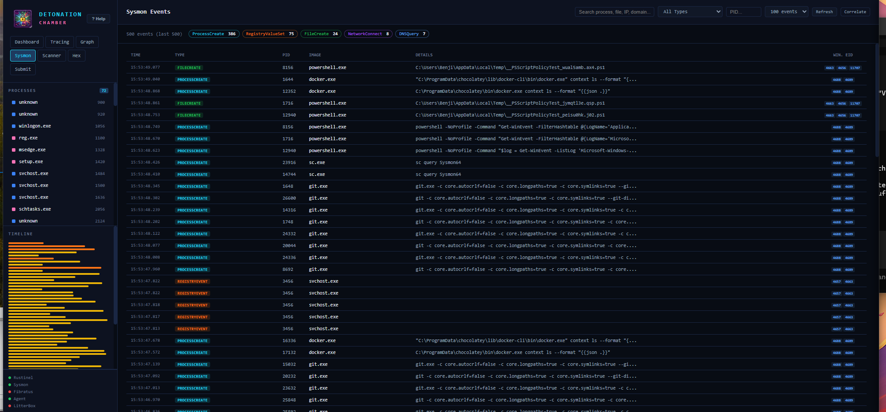
</p>
</td>
<td width="50%">
<p align="center">
  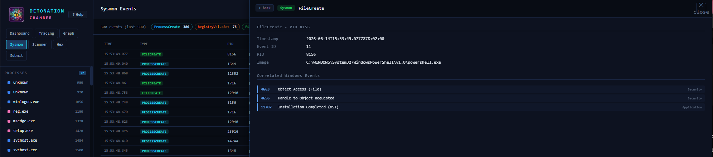
</p>
</td>
</tr>
</table>

> **Left:** Sysmon tab with 500 events. Filter pills: ProcessCreate (386), RegistryValueSet (75), FileCreate (24), NetworkConnect (8), DNSQuery (7). Table: TIME, TYPE (color-coded green/cyan/orange), PID, IMAGE, DETAILS (full command lines — powershell.exe, docker.exe, sc.exe, git.exe), WIN. EID column (4688, 4689, 4663, 4656, 11707). Search, type/PID dropdowns, max events slider, Refresh and Correlate buttons.
>
> **Right:** Detail panel for FileCreate event (PID 8156). Shows: timestamp, Sysmon Event ID 11, Image (powershell.exe). "Correlated Windows Events" maps to related log entries: 4663 "Object Access (File)" (Security), 4656 "Handle to Object Requested" (Security), 11707 "Installation Completed (MSI)" (Application) — cross-log context for the same operation.

---

## API Reference

All endpoints served on port `9000`. Responses are JSON.

### Core

| Method | Endpoint | Description |
|--------|----------|-------------|
| GET | `/api/alerts` | All detection alerts (Rustinel + Fibratus + LitterBox) |
| GET | `/api/processes` | Tracked processes with activity counts |
| GET | `/api/status` | Service health status (all components) |
| GET | `/api/rustinel` | Rustinel engine info (rules, version) |
| GET | `/api/submissions` | Submission history (last 200) |

### Submission & Detonation

| Method | Endpoint | Description |
|--------|----------|-------------|
| POST | `/api/submit` | Submit sample (multipart). Params: `file`, `target` (agent/litterbox/both) |
| GET | `/api/detonation/results` | Poll results. Params: `sha256`, `pid`, `litterbox_hash`, `filename` |

### Hex Editor & Binary Analysis

| Method | Endpoint | Description |
|--------|----------|-------------|
| GET | `/api/file/hex` | Hex dump. Params: `path`, `offset`, `bytes` |
| POST | `/api/file/hex/upload` | Upload file for hex viewing |
| GET | `/api/file/pe` | PE header analysis. Param: `path` |
| GET | `/api/file/elf` | ELF binary analysis. Param: `path` |

### Sysmon

| Method | Endpoint | Description |
|--------|----------|-------------|
| GET | `/api/sysmon` | Sysmon events. Params: `max`, `event_id`, `pid` |
| GET | `/api/sysmon/stats` | Sysmon statistics and diagnostics |

### ETW Browser

| Method | Endpoint | Description |
|--------|----------|-------------|
| GET | `/api/etw/channels` | List available channels. Param: `probe=true` adds availability status |
| GET | `/api/etw/events` | Query events. Params: `channel`, `max`, `since`, `filter` |

### Scanner

| Method | Endpoint | Description |
|--------|----------|-------------|
| POST | `/api/scan/threatcheck` | ThreatCheck scan. Params: `file`/`path`, `engine`, `type` |
| POST | `/api/scan/defendercheck` | DefenderCheck scan. Params: `file`/`path` |
| GET | `/api/scan/status` | Scanner tool availability |

### Proxy Endpoints

| Method | Endpoint | Description |
|--------|----------|-------------|
| GET/POST | `/api/litterbox/<path>` | Proxy to LitterBox API (:1337) |
| GET | `/api/fibratus/<path>` | Proxy to Fibratus API (:8180) |

---

## Configuration

### Environment Variables (Web UI)

| Variable | Default | Description |
|----------|---------|-------------|
| `RUSTINEL_ALERTS_DIR` | `C:\tools\rustinel\logs` | Rustinel NDJSON alert directory |
| `RUSTINEL_INSTALL_DIR` | `C:\tools\rustinel` | Rustinel installation root |
| `DETONATOR_API` | `http://127.0.0.1:8000` | Detonator REST API |
| `DETONATOR_AGENT_API` | `http://127.0.0.1:8080` | DetonatorAgent API |
| `LITTERBOX_API` | `http://127.0.0.1:1337` | LitterBox API |
| `WEBUI_PORT` | `9000` | Web UI listen port |

### Custom Detection Rules

**Sigma** (hot-reload):
```
C:\tools\detection-rules\rustinel-rules\dist\windows-advanced\rules\sigma\
```

**YARA** (hot-reload):
```
C:\tools\detection-rules\yara-combined\
```

**IOC Hashes** (hot-reload, add SHA-256 one per line):
```
C:\tools\detection-rules\rustinel-rules\dist\windows-advanced\rules\ioc\
```

### Defender Exclusions

Provisioning adds exclusions for detonation paths. To fully disable for testing:

```powershell
# Inside VM, run as Administrator
Set-MpPreference -DisableRealtimeMonitoring $true
```

---

## Detection Rules

| Type | Count | Source |
|------|-------|--------|
| **Sigma** | 20 rules | `Karib0u/rustinel-rules` windows-advanced pack |
| **YARA** | 717 compiled | Rustinel-rules + Elastic protections-artifacts |
| **IOC** | Dynamic | SHA-256 hash matching, auto-fed on sample submission |

**Sigma coverage:**
- 14 process_creation (encoded PowerShell, schtasks, LOLBins, credential dumping)
- 3 registry_event (Run key persistence, Defender tampering, WDigest)
- 1 task_creation (suspicious scheduled task actions)
- 1 ps_script (PowerShell script block logging)
- 1 service_creation

---

## File Structure

```
transportable-detonation-chamber/
├── Makefile                        # Build system (macOS/Linux)
├── make.ps1                        # Build system (Windows PowerShell)
├── Vagrantfile                     # VM definition (Hyper-V)
├── Vagrantfile.utm                 # VM definition (QEMU/UTM, Apple Silicon)
├── README.md
├── tdc-logo.png
│
├── static/                         # Screenshots for documentation
│   ├── dashboard.png
│   ├── mimikatz_detonation.png
│   ├── rustinel_analysis.png
│   ├── rustinel_analysis_details.png
│   ├── process_rollup.png
│   ├── process_rollup_details_scan_correlation.png
│   ├── pe_header_analyzer.png
│   ├── PE_header_packing_analyzer.png
│   ├── pe_analyzer_text_header_section.png
│   ├── hex_editor.png
│   ├── sysmon_event_ids.png
│   └── sysmon_windows_event_id_correlation.png
│
├── webui/                          # Unified Web UI
│   ├── app.py                     # Flask backend (APIs, proxying, PE/ELF analysis)
│   ├── dev_server.py              # Dev server with live-reload
│   ├── requirements.txt           # Python deps (flask, requests, watchdog, pefile)
│   ├── templates/
│   │   └── index.html             # SPA with all tabs + Help modal
│   └── static/
│       ├── css/style.css          # Dark theme (~5000 lines)
│       ├── js/app.js              # Frontend logic (~5500 lines)
│       └── icon.png               # Logo
│
├── config/
│   ├── rustinel-config.toml       # Rustinel config (sigma/yara/ioc paths)
│   ├── fibratus.yml               # Fibratus config (JSON eventlog output)
│   └── profiles_init.yaml         # Detonator target profiles
│
├── rules/                          # Detection rules (copied to VM)
│
├── scripts/                        # Provisioning scripts
│   ├── install-prerequisites.ps1  # .NET 8, Python 3.12, Git, 7-Zip
│   ├── install-sysmon.ps1         # Sysmon (ARM64-aware)
│   ├── install-fibratus.ps1       # Fibratus v3.0.0
│   ├── install-rustinel.ps1       # Rustinel v1.1.1
│   ├── install-detection-rules.ps1 # Sigma + YARA rules
│   ├── install-detonator.ps1      # Detonator + DetonatorAgent
│   ├── install-litterbox.ps1      # LitterBox sandbox
│   ├── install-thezoo.ps1        # theZoo malware repository + WebUI
│   ├── install-hunt-sleeping-beacons.ps1 # Hunt-Sleeping-Beacons (VS Build Tools + compile)
│   ├── install-re-tools.ps1      # Detect It Easy, WinDbg, Ghidra
│   ├── install-webui.ps1          # Web UI deployment
│   └── configure-services.ps1    # Service registration (runs on every boot)
│
└── test_alerts/                    # Test data for pipeline verification
```

### VM File Layout

```
C:\DetonationChamberUI\             Web UI (Flask)
C:\tools\rustinel\                  Rustinel ETW engine + rules
C:\tools\fibratus\                  Fibratus kernel tracer
C:\DetonatorAgent\                  .NET 8 execution agent
C:\LitterBox\                       Analysis sandbox
C:\tools\ThreatCheck\               AV signature scanner
C:\tools\DefenderCheck\             Defender evasion tester
C:\tools\Hunt-Sleeping-Beacons\     Sleeping beacon scanner
C:\tools\theZoo-WebUI\              theZoo malware sample browser (:8888)
C:\tools\detection-rules\           Sigma + YARA + IOC rules
C:\ProgramData\chocolatey\lib\die\  Detect It Easy (DiE 3.21)
C:\ProgramData\chocolatey\lib\ghidra\ Ghidra 12.1.2
WinDbgX.exe                         WinDbg Preview (via winget)
C:\Users\vagrant\Desktop\infected\  Malware samples (Defender-excluded)
```

---

## Troubleshooting

### Check service status

```bash
# macOS / Linux
make services

# Windows
.\make.ps1 services
```

Expected output:
```
  SERVICE               STATE
  -------               -----
  DetonationChamberUI   Running
  Rustinel              Running
  DetonatorAgent        Running
  LitterBox             Running
  Fibratus              Running
  Sysmon                Running
  theZoo-WebUI          Running
```

### Services not starting

```powershell
# SSH/RDP into the VM
vagrant ssh  # or: vagrant rdp

# Check and restart services
Get-ScheduledTask -TaskName DetonationChamberUI | Start-ScheduledTask
Get-ScheduledTask -TaskName Rustinel | Start-ScheduledTask
Get-ScheduledTask -TaskName DetonatorAgent | Start-ScheduledTask
Get-ScheduledTask -TaskName LitterBox | Start-ScheduledTask

# View logs
Get-Content C:\tools\logs\DetonatorAgent.log -Tail 50
Get-Content C:\tools\logs\DetonationChamberUI.log -Tail 50
```

### Port forwarding not working (Hyper-V)

Hyper-V uses a virtual switch. Connect directly via the VM's IP:

```powershell
# Find VM IP
.\make.ps1 status
# Or: vagrant ssh -c "ipconfig"

# Override in make.ps1
.\make.ps1 status -VMIp 172.17.x.x
```

### Web UI not loading

```bash
# Check if Flask is running
make status  # or: .\make.ps1 status

# Restart it
make restart  # or: .\make.ps1 restart

# View logs
make logs  # or: .\make.ps1 logs
```

### Rustinel not detecting events

```powershell
# Inside the VM:
Get-Process rustinel
Get-Content C:\tools\rustinel\logs\rustinel.log.* | Select-Object -Last 20
logman query -ets | findstr rustinel

# Restart if stale
logman stop rustinel-etw-trace -ets 2>$null
Start-ScheduledTask -TaskName "Rustinel"
```

### macOS: QEMU won't start

```bash
qemu-system-aarch64 --accel help  # Should show: hvf
ls /opt/homebrew/share/qemu/edk2-aarch64-code.fd
vagrant plugin list | grep qemu
```

### Local install fails

```bash
# Verify Python version (needs 3.10+)
python3 --version

# If venv creation fails, try:
make uninstall  # or: .\make.ps1 uninstall
make install    # or: .\make.ps1 install
```

---

## Security Notes

> **This VM is designed for malware analysis — treat it as compromised.**

- Use **snapshots** before each detonation (`vagrant snapshot save clean_state`)
- **Network isolation** recommended (Hyper-V internal/private switch)
- Defender exclusions configured for detonation paths only
- Rustinel active response is **disabled by default**
- The Web UI has no authentication — bind to localhost or use on isolated networks only

---

## Credits

| Project | Role |
|---------|------|
| [dobin/detonator](https://github.com/dobin/detonator) | Orchestration framework |
| [dobin/DetonatorAgent](https://github.com/dobin/DetonatorAgent) | Execution agent |
| [rabbitstack/fibratus](https://github.com/rabbitstack/fibratus) | ETW detection engine |
| [Karib0u/rustinel](https://github.com/Karib0u/rustinel) | Sigma/YARA EDR agent |
| [BlackSnufkin/LitterBox](https://github.com/BlackSnufkin/LitterBox) | Payload analysis sandbox |
| [thefLink/Hunt-Sleeping-Beacons](https://github.com/thefLink/Hunt-Sleeping-Beacons) | Sleeping beacon callstack scanner |
| [ytisf/theZoo](https://github.com/ytisf/theZoo) | Malware sample repository |
| [kawaiipantsu/theZoo-WebUI](https://github.com/kawaiipantsu/theZoo-WebUI) | theZoo web frontend |
| [horsicq/DIE-engine](https://github.com/horsicq/DIE-engine) | Detect It Easy |
| [NationalSecurityAgency/ghidra](https://github.com/NationalSecurityAgency/ghidra) | Ghidra RE framework |
| [Microsoft WinDbg](https://learn.microsoft.com/en-us/windows-hardware/drivers/debugger/) | Windows debugger |

---

<p align="center">
  <sub>Built for security research and EDR testing. Use responsibly.</sub>
</p>
